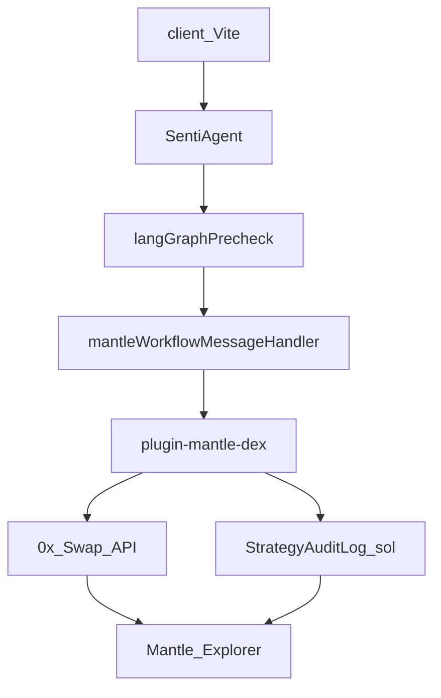

# Mantle Global Hackathon — SentiEdge Submission

## Overview

End-to-end **Mantle-native AI trading demo**: chat → multi-signal analysis → risk/approval gates → **0x swap on Mantle** with **StrategyAuditLog** on-chain intent events.

**Branch:** `feature/mantle-hackathon`  
**Primary chain (Gate A):** Mantle mainnet `5000` via 0x (Sepolia `5003` via `MANTLE_CHAIN_ID=5003`)  
**Signing (MVP):** Server demo wallet (`MANTLE_PRIVATE_KEY`) — stretch: client EOA connect in header  
**Gate log:** Run `node scripts/mantle/gate-check.mjs --write-docs` after setting `ZERO_EX_API_KEY`

---

## Architecture



---

## Criteria Matrix

| Criterion | Points | Feature | Proof |
|-----------|--------|---------|-------|
| A Technical | 15 | Live swap tx from chat | `execute_mantle_swap` + explorer link in response |
| A Ecosystem | 10 | 0x + Moe/Agni routes | 0x `sources` in quote; docs reference Merchant Moe / Agni |
| A UX | 5 | Wallet connect | Header **Connect Mantle Wallet** (`EtherspotConnect.tsx`) |
| B Transparency | 7.5 | Audit + swap linked | `intentHash` in quote approval + `log_mantle_intent` tx |
| B Strategy | 7.5 | Risk refusal | `mantleRiskEngine` blocks YOLO / oversize / slippage |
| B BGA ethos | 10 | Paper CEX vs on-chain disclosure | Badges in workflow responses |
| B Execution | 5 | Video + public URL | 3-min demo script below; Cloud Run deploy |

---

## Gate Decisions (Step 0)

| Gate | Result | Decision |
|------|--------|----------|
| **A — 0x on Sepolia 5003** | Aggregators rarely serve testnets | **Primary: mainnet 5000**; set `MANTLE_CHAIN_ID=5003` to try Sepolia |
| **B — Etherspot Prime** | Unverified on Sepolia bundler | **Fallback: injected EOA** (`window.ethereum`) in client; server wallet for execution MVP |
| **C — Tokens** | Sepolia: WMNT `0x19f5…deD5` | Mainnet: USDC `0x09Bc…0dF9`, WMNT `0x78c1…4cb8` in `config/tokens.ts` |

Gate probe log: [`docs/mantle-gate-results.md`](./mantle-gate-results.md)

---

## Demo Script (3 min)

1. **Happy path (0:00–1:15)** — "Analyze BTC sentiment" → "swap 5 USDC to WMNT on Mantle" → review quote → `approve` → show swap tx + audit intent hash
2. **Risk refusal (1:15–2:00)** — "swap all my balance YOLO on Mantle" → blocked with explanation
3. **Approval cancel (2:00–2:30)** — quote → `cancel` → no tx
4. **BGA narrative (2:30–3:00)** — CEX paper mode vs Mantle on-chain badges side by side

---

## Setup

```bash
pnpm install
cp .env.example .env
# Required for live swap: ZERO_EX_API_KEY, MANTLE_PRIVATE_KEY (demo funds only)
# Quote-only gate test needs only ZERO_EX_API_KEY
# Optional: MANTLE_AUDIT_LOG_ADDRESS after deploy

# Gate A smoke test (quote only)
node scripts/mantle/gate-check.mjs
node scripts/mantle/gate-check.mjs --write-docs
node scripts/mantle/smoke-swap.mjs --quote-only

# Compile + deploy audit contract (requires MANTLE_PRIVATE_KEY + faucet MNT)
forge build
node scripts/mantle/deploy-audit-log.mjs

pnpm build
pnpm start          # agent
pnpm start:client   # UI
```

### Cloud Run (Singapore public demo)

```bash
SOURCE_ENV=.env scripts/geap/deploy-public-sg.sh
```

Env keys passed via `scripts/geap/prepare-cloud-run-env.py`: `ZERO_EX_API_KEY`, `MANTLE_RPC_URL`, `MANTLE_CHAIN_ID`, `MANTLE_PRIVATE_KEY`, `MANTLE_AUDIT_LOG_ADDRESS`, risk caps.

---

## Key Files

| Path | Purpose |
|------|---------|
| `packages/plugin-mantle-dex/` | Swap actions, 0x client, risk engine |
| `packages/core/src/handlers/mantleWorkflowMessageHandler.ts` | Two-turn approval workflow |
| `contracts/StrategyAuditLog.sol` | On-chain intent events |
| `scripts/mantle/smoke-swap.mjs` | Pre-agent chain validation |
| `client/src/components/mantle/` | Wallet connect + explorer links |

---

## Known Limits

- Server-side demo wallet holds ≤$10 faucet/mainnet funds; rotate key post-hackathon
- Etherspot gasless AA is stretch — injected wallet is Gate B fallback
- Short-circuit regex routing only (no LLM classifier enum change — avoids `test:ci-gates` blast radius)
- Sepolia 0x liquidity may be unavailable; mainnet is the judged path

---

## BGA Ethos

SentiEdge prioritizes **transparent, risk-gated** execution over raw PnL. Mantle on-chain mode complements CEX paper trading for strategy rehearsal without encouraging YOLO behavior.
